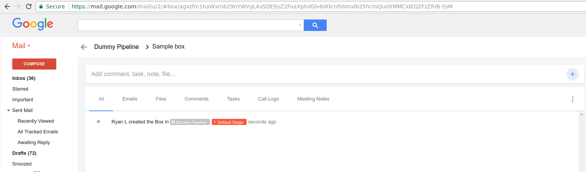
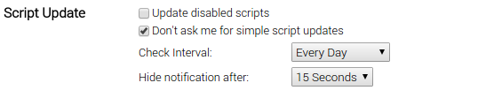
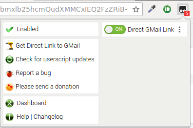

= Direct Links to GMail
:name: direct-gmail
:inbox: https://www.google.com/inbox/[Google Inbox]
:gmail: https://www.google.com/gmail/[GMail]
:streak: https://www.streak.com/[Streak]
:tampermonkey: https://tampermonkey.net/[TamperMonkey]
:repo: CodeLenny/direct-gmail
:version: master
:script: direct-gmail
:experimental:
:install: https://raw.githubusercontent.com/{repo}/{version}/{script}.user.js[{script}.user.js]
:toc: preamble

Want to use {inbox} for most things, but still need to use the old {gmail} interface, such as for {gmail} plugins like
{streak}?

With {name} extension, you can leave the automated {gmail}->{inbox} redirect in place, but quickly get a hotlink back
into the old interface.

== Streak Example

Given the current URL, like the one used for Streak inboxes, {name} will copy a direct link into your clipboard:

.Converted URL
----
https://mail.google.com/mail/?ibxr=0&authuser=example@gmail.com#box/agxz[...]h3CoM
----

To create the direct link, {name} will insert `?ibxr=0` before the `#` in the URL, which is the internal code to prevent
{gmail} from directing to {inbox}.

Then, the user portion of the URL (`/u/2/`) will be replaced with an `authuser` parameter, so you don't need to keep the
accounts signed in with the same order.
The `authuser` parameter will take the form of `?authuser=example@gmail.com`.

Please note that many extensions take a few moments to load themselves and act upon the URL.  During this time, {gmail}
may modify the URL, potentially removing the `box` snippet.  Even so, some plugins may be able to cope with this change.
For {streak}, the inbox will be shown for 15-20 seconds, but then the box linked will load,
and the URL will change back.

== Installation

1. Install {tampermonkey} in your browser.
2. Visit {install}.  {tampermonkey} should prompt you to install the script.

The script is configured to automatically update itself when new versions are released.
You may want to update the update interval in the {tampermonkey} settings to get updates quicker
- by default, scripts are only updated every few weeks.

Adjust the update period inside the TamperMonkey dashboard under
menu:Dashboard[Settings > Script Update > Check Interval].

== Usage

After visiting `mail.google.com`, select the {tampermonkey} icon in the browser menu.
Choose "Get Direct Link to GMail" in the menu that pops up.

